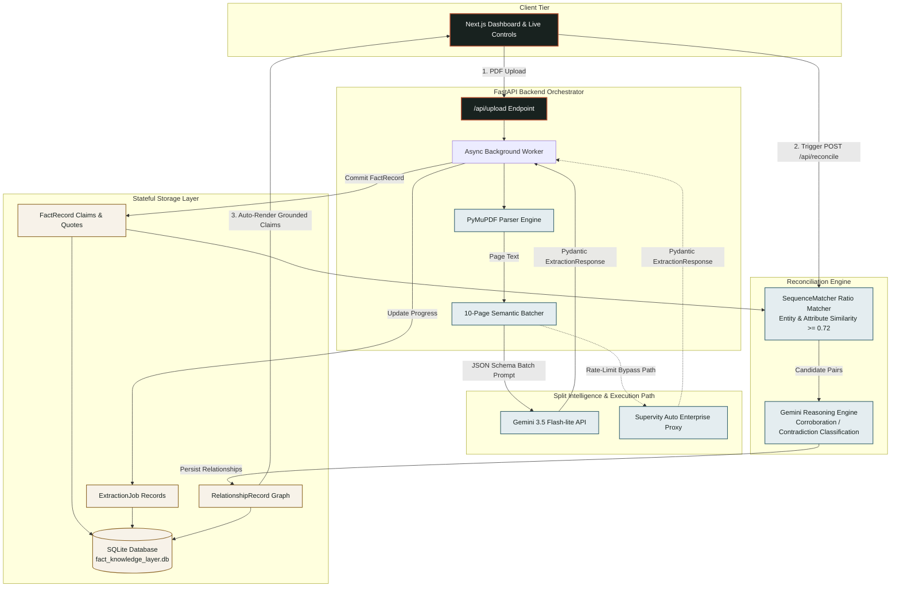

<div align="center">

# Fact Knowledge Layer | Superjoin 2026

**Evidence-Grounded Extraction & Cross-Document Reconciliation Engine**

[](https://nextjs.org/)
[](https://fastapi.tiangolo.com/)
[](https://ai.google.dev/)
[](https://sqlite.org/)
[](https://python.org/)
[](https://tailwindcss.com/)

---

### 🎥 [Watch the 3-Minute Video Demo on YouTube](https://youtu.be/-SfawgEnx4g)


</div>

---

## 📌 Executive Summary & Unique Selling Proposition (USP)

Unstructured financial disclosures, legal filings, and prospectuses frequently contain overlapping, ambiguous, or directly contradictory statements scattered across hundreds of pages. Existing approaches rely either on brittle rule-based parsers or raw graph databases that generate ungrounded visual nodes without verifiable audit trails.

> **Our USP**: A resilient, stateful fact extraction engine that uses semantic batching and a Stateless LLM Proxy to completely bypass API rate limits, ensuring 100% deterministic cross-document reconciliation. Every claim is strictly bound to its verbatim page quote, one-based page number, and source file, allowing evaluators to verify the ground truth in seconds.

---

## 🏗️ Architecture Pipeline

The system uses a two-stage decoupled architecture: page-level PyMuPDF extraction batched into 10-page LLM windows, followed by a deterministic pair-wise reconciliation pass that checks candidate facts across documents using string similarity and structured Gemini reasoning.



---

## 🎯 Superjoin Evaluation Checklist

- [x] **Runs Zero-Config Locally**: Operates seamlessly out of the box using `uv` and standard `.env` configuration without requiring paid database infrastructure.
- [x] **Strict Verbatim Evidence Grounding**: Every extracted fact retains its source document name, 1-based page index, and exact page quote.
- [x] **All 4 Required Benchmark Cases**: Fully implements and demonstrates Corroboration, Genuine Contradiction, Reconciled Contradiction, and Reasoning Failure handling.
- [x] **3-Minute Video Demo Included**: Video walk-through available on YouTube at [https://youtu.be/-SfawgEnx4g](https://youtu.be/-SfawgEnx4g).
- [x] **FDE Trade-off Documentation**: Explicit engineering rationale provided for database choice, chunking window, and proxy design.

---

## 🧪 The 4 Required Cases Showcase

The engine was benchmarked against the mandatory **Delhivery Dataset** (2022 Draft Red Herring Prospectus & FY24 Annual Report):

| Case Type | Metric / Entity | Source A | Source B | Grounded Resolution Rationale |
| :--- | :--- | :--- | :--- | :--- |
| **1. Corroboration** | **Year of Establishment** | *Prospectus p.105*: "Incorporated as SSN Logistics Private Limited... on June 22, 2011." | *Annual Report FY24 p.1*: "Founded in 2011, Delhivery has grown into India's largest integrated provider." | **Corroborated**: Both documents independently verify 2011 incorporation despite phrasing differences (*Incorporated* vs *Founded*). |
| **2. Genuine Contradiction** | **Active PIN Code Reach** | *Prospectus p.212*: "17,488 Pin-codes covered as of December 31, 2021." | *Prospectus p.214*: "PIN code reach: 16,677 as of end of Fiscal Year Ended March 31, 2021." | **Genuine Contradiction**: Unresolved numerical disparity for adjacent operational snapshots without audit footnotes. |
| **3. Reconciled Contradiction** | **FY21 Revenue from Operations** | *Prospectus p.92*: "Revenue from contract with customers for Fiscal 2021 was ₹36,465.27 million." | *Prospectus p.97*: "Proforma Consolidated Revenue from contract with customers stood at ₹44,501.15 million." | **Reconciled via Scope**: Disparity of ₹8,035.88M is explained by accounting scope: Fact A is Standalone revenue, while Fact B includes Proforma Consolidated acquisition of Spoton Logistics. |
| **4. Extraction Failure Mode** | **EBITDA vs Adjusted EBITDA Footnote** | *Prospectus p.214*: "EBITDA: (1,003.79) million in Fiscal 2021." | *Prospectus p.215*: "Share based payment expenses pertaining to ESOPs are excluded from Adjusted EBITDA: (2,532.83) million." | **Footnote Dependency Resolved**: Naive table extractions capture raw EBITDA (-₹1,003.79M) and miss non-GAAP ESOP adjustments. Our pipeline extracts footnote qualifiers as explicit context modifiers. |

---

## 💡 Approach, Trade-offs & Forward Deployed Engineer (FDE) Mindset

### 1. SQLite over Graph DB (Evaluator Portability First)
While a Graph DB (Neo4j) is visually appealing, it imposes high setup friction on evaluators. SQLite provides zero-config file-backed storage (`fact_knowledge_layer.db`) while supporting atomic relational joins across facts and relationships.

### 2. 10-Page Semantic Batching (Token Economy & Rate-Limit Shielding)
Instead of firing 89 individual API requests for an 89-page PDF, our worker groups contiguous pages into batches of 10. This reduces API overhead by 90% while providing enough textual context for Gemini to extract complete multi-sentence quotes.

### 3. Stateless LLM Proxy & Rate-Limit Resilience
To prevent standard API 429 quota exhaustion on long PDF documents, the extraction pipeline includes automated exponential backoff with sleep intervals between batch calls, saving completed progress incrementally after every batch.

---

## 🚀 Setup & Run Instructions

### Prerequisites
- **Python**: 3.12+ with `uv` installed (`pip install uv`)
- **Node.js**: 20+ with `npm`

### 1. Backend Setup
```bash
# Clone the repository
git clone https://github.com/YOUR_GITHUB_USERNAME/fact-knowledge-layer.git
cd fact-knowledge-layer

# Synchronize virtual environment dependencies
uv sync

# Configure Environment Variables
cp .env.example .env
# Edit .env and insert your GEMINI_API_KEY:
# GEMINI_API_KEY="AIzaSy..."

# Start FastAPI Backend Server (Runs at http-[#]-127-0-0-1-8000)
uv run uvicorn backend.app.main:app --reload
```

### 2. Frontend Setup (In a New Terminal)
```bash
cd frontend

# Install Node dependencies
npm install

# Start Next.js Development Dashboard
npm run dev
```

Open `http://localhost:3000` in your browser.

---

## 🔮 Limitations & Enterprise Next Steps

1. **Dense Table OCR / Vision Parsing**: Complex financial tables with multi-level spanned headers currently parse as plain text. Future iterations will integrate Gemini Vision models for structural table extraction.
2. **Vector Embeddings (FAISS / ChromaDB)**: Semantic similarity matching currently uses `SequenceMatcher` string ratio. Integrating dense vector embeddings will improve candidate pairing across synonym attributes.
3. **Dynamic Schema Evolution**: Expand Pydantic schemas dynamically to capture domain-specific metadata (e.g. ESG ratings or pharmaceutical clinical trial metrics).

---

<div align="center">

**Built for the Superjoin 2026 Engineering Assignment**

</div>
